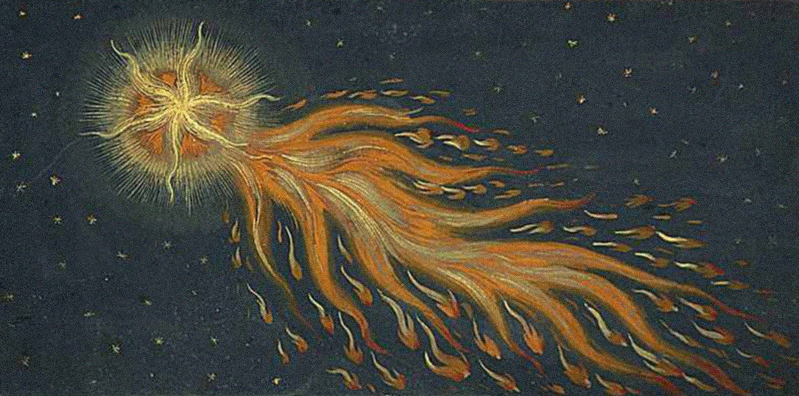

# Sidus

<aside>

Após as Completas, deu-se início ao Grande Silêncio. Instintivamente gesticulou seu adeus à massa negra-branca de hábitos e seguiu em direção a sua pequena cela. Aquele pequeno quarto servia como sua morada neste mundo desde sempre, em sua memória. Não conseguiria conceber um mundo sem o claustro, ele era tão eterno quanto o céu e tão imutável como a Trindade. 

Lentamente girou o pequeno trinco. Estava só. Durante muitas luas adormecera tranquilamente naquela pequena cama, embora a palha do colchão incomodasse um pouco — tolerável, pois a outra opção seria estar vulnerável às nojentas criaturas que vagam nas fissuras das grossas paredes de pedra. Ultimamente, entretanto, seu espírito se recusava a adormecer. 

Seus pensamentos flutuaram, cambalearam e depositaram-se sobre os campos. Mais especificamente, os campos de uva; as vinículas. Tão importante fruto, responsável pela produção do vinho, parte integral das Ofertas, parecia não vingar como deveria naquele ano.

Mestre! Não temos vinho! Não temos vinho, Mestre! 

<i>Solvitur ambulando</i>. Desceu rapidamente, ou, pelo menos, o quão rápido conseguia sem que seus passos perturbassem seus vizinhos, e dirigiu-se às suas plantas. Observou-as, ajoelhou diante delas, levantou-se, observou novamente... nada parecia satisfazer sua mente. Algo estava errado, profundamente errado. Não sabia o que deveria ser. Será que realmente alguma coisa estaria fora da ordem cósmica? Não estaria seu espírito perturbado com sua própria perturbação? Não...

Não, não, algo <i>deveria</i> estar errado com as plantas, com o mundo. Afinal, ele não era louco e, talvez mais importante que isso, ele não era <i>incompetente</i>. O velho Jehonatan não havia escolhido ele para coordenar os irmãos na lavoura se seu escolhido não soubesse o que deveria fazer. Algo... algo deveria estar errado com as plantas, com o mundo. Algo... algo... 

Enquanto estava perdido em seus pensamentos, em sua ruminância, em seu inferno pessoal, deu-se conta que a posição dos astros indicava que as Matinas estavam próximas. Teria aquele sofrimento demorado tanto assim? Enquanto observava o gélido céu, protegido por seu negro hábito, observou <i>algo</i>. Tentou identificar o que era, falhou, sentiu medo. 

Naquela noite, lembro-me bem — se é que é possível dizer que lembro um semissonho — de observar no fundo dos céus uma estrela. Esta estrela não era como as outras. Seria realmente uma estrela? Naquele momento não sabia. Até hoje não sei dizer. Ela aumentou, alongou-se, cruzou o céu como uma carruagem de Hélio, chamuscou tons sanguíneos e douros e desapareceu. Logo após, uma discreta coluna de fumaça discreta formou-se no horizonte, nas Montanhas.

Uma curta eternidade depois, desviou seu olhar para o Pórtico. Uma sucessão de sinais se desenrolava nas proximidades da antiga estrutura. M-A-T-U-T-I-N-A-E. Rapidamente levantou suas mãos. V-E-R-O. Cruzou o pesado portão de carvalho e serpenteou pelos crepusculares corredores graníticos até entrar na Nave. Estava sendo atormentado pela vontade de falar, de externar o que não podia ser expresso e imprimir sua visão sobre o que não podia mais ser visto. 

<i>Dómine, lábia mea apéries... Et os meum annuntiábit laudem tuam... Veníte, exsultémus Dómino... iubilémus Deo salutári nostro... Præoccupémus fáciem eius in confessióne... et in psalmis iubilémus ei... <b>Abbas! Abbas! Sidus vidi! Vidi! Sidus vidi!</b></i>

⁂

Ao terminarmos nossa segunda escalada, conseguimos ver o vale do outro lado e, naquele vale, uma estrutura metálica — estava convencido desde que vi que possuía tal natureza — mais ou menos esférica, parcialmente submergida no terreno. Inicialmente não tinha compreendido como era possível essa submersão, mas o contato de meus pés com o terreno encharcado rapidamente vaporizou todas as minhas dúvidas. Uma portinhola abriu-se quando nos aproximamos... 

⁂

Cada minuto daquela planície era insuportável. 

</aside>

<aside>

<i></i>

</aside>