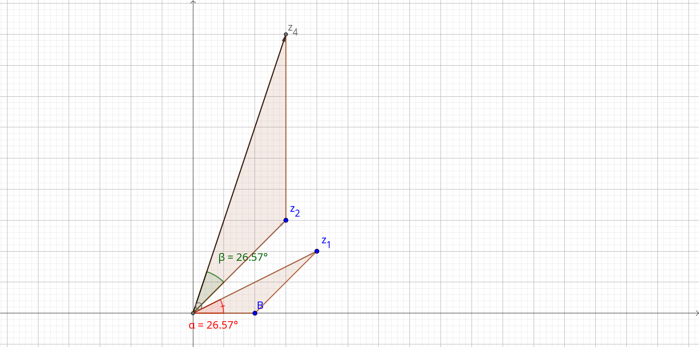

# Números complexos 

# O corpo dos complexos

O conjunto dos números complexos possui como base a unidade imaginária, $i$, definida de forma que $i^2 = -1$. Dessa forma, representamos um número complexo qualquer por uma expressão 

$$
z = a + bi 
$$

onde $a$ e $b$ são números reais. Consequentemente, representamos o conjunto de todos os números complexos por 

$$
\mathbb{C} = \{a + bi | a,b \in \mathbb{R} \}
$$

Neste conjunto, definimos a soma e o produto entre dois números complexos quaisquer $z_1 = a_1 + b_1i$ e $z_2 = a_2 + b_2i$, respectivamente, como: 

$$
\begin{align*}
    z_1 + z_2 &= (a_1 + b_1i) + (a_2 + b_2i) = (a_1 + a_2) + (b_1 + b_2)i \\ 
    z_1 \cdot z_2 &= (a_1 + b_1i)(a_2 + b_2i) = (a_1a_2 - b_1b_2) + (a_1b_2 + a_2b_1)i
\end{align*}
$$

Além disso, definimos a divisão entre dois números complexos quaisquer $z_1 = a_1 + b_1i$ e $z_2 = a_2 + b_2i$ como 

$$
\dfrac{z_1}{z_2}=\dfrac{a_1 + b_1i}{a_2 + b_2i} = \dfrac{(a_1 + b_1i)(a_2 - b_2i)}{(a_2 + b_2i)(a_2 - b_2i)} = \dfrac{a_1a_2 + b_1b_2}{a_2^2 + b_2^2} + i\left(\dfrac{a_2b_1 - a_1b_2}{a_2^2 + b_2^2}\right)
$$

Denominamos $z = a + bi$ como um número complexo <b>real</b> se $b = 0$. Por outro lado, se $a = 0$ e $b \neq 0$, $z$ é dito um número complexo <b>puro</b>. Perceba que se $b=0$, $z$ é um número real: os números reais podem ser vistos como um subconjunto dos complexos. 

Assim como os números reais, os números complexos dotados das operações de soma e multiplicação previamente definidas formam um <b>corpo</b>, possuindo as propriedades a seguir: 

<aside>

1. $(z_1 + z_2) + z_3 = z_1 + (z_2 + z_3)$
2. $z_1 + z_2 = z_2 + z_1$
3. $\forall z \in \mathbb{C}, z + 0 = z$ 
4. $\forall z \in \mathbb{C}, \exists w \in \mathbb{C}$ único, tal que $z + w = 0$
5. $(z_1z_2)z_3 = z_1(z_2z_3)$ 
6. $z_1z_2=z_2z_1$
7. $\forall z \in \mathbb{C}, 1z = z$
8. $\forall z \in \mathbb{C}, z \neq 0, \exists w \in \mathbb{C}$ único, tal que $zw = 1$
9. $z_1(z_2 + z_3) = z_1z_2 + z_1z_3$

</aside>

Definimos o conjugado de um número complexo $z = a + bi$, representado por $\bar{z}$, como o número $\bar{z} = a - bi$. 

<aside>

<b>Teorema</b> — Dados dois números complexos, o conjugado de seu produto é o produto de seus conjugados. 

</aside>

<aside>

<b>Demonstração</b> — Sejam $z_1 = a_1 + b_1i$ e $z_2 = a_2 + b_2i$ números complexos. Temos que $\bar{z_1} = a_1 - b_1i$ e $\bar{z_2} = a_2 - b_2i$ e, assim,

$$
\begin{align*}
    \bar{z_1} \cdot \bar{z_2} &= (a_1 - b_1i)(a_2 - b_2i) \\ 
                              &= a_1a_2 - a_1b_2i - b_1ia_2 + b_1b_2i^2 \\ 
                              &= a_1a_2 - a_1b_2i - b_1a_2i - b_1b_2 \\ 
                              &= a_1a_2 - b_1b_2 - (a_1b_2 + b_1a_2)i
\end{align*}
$$

Por outro lado, o produto $z_1z_2$ é dado por:

$$
\begin{align*}
    z_1z_2 &= (a_1 + b_1i)(a_2 + b_2i) \\ 
           &= a_1a_2 + a_1b_2i + a_2b_1i - b_1b_2 \\ 
           &= a_1a_2 - b_1b_2 + (a_1b_2 + a_2b_1)i
\end{align*}
$$

e, consequentemente, 

$$
\bar{z_1z_2} = a_1a_2 - b_1b_2 - (a_1b_2 + a_2b_1)i = \bar{z_1} \cdot \bar{z_2}
$$

como queríamos demonstrar.

</aside>

<aside>

<b>Teorema</b> — Dado um número complexo qualquer, este é o conjugado de seu conjugado.

</aside>

<aside>

<b>Demonstração</b> — Seja $z = a + bi$ um número complexo. Logo, temos que $\bar{z} = a - bi$ e $\bar{\bar{z}} = a + bi = z$.

</aside>

<aside>

<b>Teorema</b> — Dados dois números complexos $z_1 = a_1 + b_1i$ e $z_2 = a_2 + b_2i$, o conjugado de sua soma é a soma de seus conjugados.

</aside>

<aside>

<b>Demonstração</b> — Tomando o conjugado de ambos os números, somando e reorganizando os termos, obtemos: 

$$
\bar{z_1} + \bar{z_2} = a_1 + a_2 - b_1i - b_2i = a_1 + a_2 - (b_1 + b_2)i 
$$

Por outro lado, temos que $z_1 + z_2 = a_1 + a_2 + (b_1 + b_2)i$ e, consequentemente, $\bar{z_1 + z_2} = a_1 + a_2 - (b_1 + b_2)i = \bar{z_1} + \bar{z_2}$.

</aside>

Pelos conjugados é possível agora introduzir a noção de <b>norma</b> no conjunto dos números complexos. Assim, o módulo de $z$ é dado por 

$$
|z| = \sqrt{z \cdot \bar{z}} = \sqrt{a^2 + b^2}
$$

# Interpretação geométrica

Assim como os reais, podemos representar os números complexos como pontos num plano, chamado <b>plano complexo</b>. Podemos nomear estes pontos como <b>imagens</b> ou <b>afixos</b>. Dessa forma, um número complexo $z = a + bi$ é associado ao ponto $(a, b)$, sua imagem. O eixo horizontal coordenado do plano é chamado <b>eixo real</b>, enquanto o eixo vertical é chamado <b>eixo imaginário</b>. 

Com efeito, em questões de notação, utilizamos $\Re{(z)}$ ou simplesmente $\text{Re}(z)$ para denotar a <b>parte real</b> de um número complezo $z$. Similarmente, $\Im{(z)}$ ou $\text{Im}(z)$ denota sua parte imaginária. Assim, para um número complexo qualquer $z = a + bi$, vale $\text{Re}(z) = a$ e $\text{Im}(z) = b$.

Geometricamente, o produto pelo símbolo $i$ pode ser lido como uma rotação de $\dfrac{\pi}{2}$ radianos no sentido anti-horário, aplicada no vetor-ponto relacionado ao número complexo dado. Daqui, a noção de que $i^2 = -1$, previamente tida como axioma, sai naturalmente das consequências geométricas. 

<aside>

De forma mais simples, a justificativa para a definição da soma entre dois números complexos ser daquela maneira também surge naturalmente: é uma soma regular entre vetores no plano. 

</aside>

Para ilustrar isso, considere um vetor representando o número $z = 1 + 0i$. Rotacionar este vetor em $\dfrac{\pi}{2}$ leva-o ao número $z = i$ e, ao rotacionarmos este novamente, chegamos em $z = -1$. 

Desta mesma visão geométrica dos números complexos parte a justificativa do <b>módulo</b> de um número real, que é apenas um caso particular da norma dos números complexos.

# Fórmula de Euler e a representação polar

Considere a seguinte <a href="/books/higher_education/math/calculus_two/differential_equations.html" target="_blank">equação diferencial</a> linear de primeira ordem:

$$
\dfrac{df}{dx} = \lambda f(x) 
$$

Temos que a função $f(x) = e^{\lambda x}$ satisfaz esta equação na condição de que $f(0) = 1$. Perceba então que, pelas regras de derivação do seno e do cosseno, podemos escrever 

$$
\dfrac{d}{dx}(\cos{x} + i\sin{x}) = i\cos{x} - \sin{x} = i(\cos{x} + i\sin{x})
$$

Quando $x = 0$, $\cos{x} + i\sin{x} = 1$. Assim, somos levados a escrever

$$
e^{ix} = \cos{x} + i\sin{x}
$$

pois a função criada também é uma solução para a equação diferencial nessa mesma condição. A esta relação damos o nome <b>fórmula de Euler</b> em razão de ser formulada pelo próprio Leonhard Euler em 1748. 

Tomando as partes real e imaginária desta equação obtemos mais duas importantes relações: 

$$
\begin{align*}
    \cos{x} &= \Re{(e^{ix})} = \dfrac{1}{2}(e^{ix} + e^{-ix}) \\ 
    \sin{x} &= \Im{(e^{ix})} = \dfrac{1}{2i}(e^{ix} - e^{-ix})
\end{align*}
$$

Assim, isso possibilita a representação de um número complexo em coordenadas polares, de forma que 

$$
z = a + bi = |z| (\cos{\theta} + i\sin{\theta}) = |z| e^{i\theta}
$$

é chamada a <b>forma trigonométrica</b> (ou <b>polar</b>) de $z$. Nesta expressão, $|z|$ é o módulo de $z$ enquanto $\theta$ é chamado seu <b>argumento</b>. 

$$
\theta = \arg{z} = \tan^{-1}\left(\dfrac{b}{a}\right)
$$

Perceba que $|e^{i\theta}| = 1, \forall \theta \in \mathbb{R}$. Um número complexo desta forma, isto é, $z = e^{i\theta}$, é chamado <b>fator de fase</b>, com sua imagem sendo um ponto no círculo unitário do plano complexo.

A fórmula de Euler nos permite calcular a exponencial de um número complexo qualquer $z = a + bi$, pois é válido que: 

$$
e^{a + bi} = e^a \cdot e^{bi} = e^a(\cos{b} + i\sin{b})
$$

Além disso, ela nos permite facilmente denotar o produto entre dois números complexos por meio de sua representação polar:

$$
z_1z_2 = (|z_1|e^{i\theta_1})(|z_2|e^{i\theta_2}) = |z_1||z_2| e^{i(\theta_1 + \theta_2)}
$$

<i>Representação geométrica do produto entre dois números complexos. Esse produto pode ser realizado no plano pela confecção de dois triângulos semelhantes.</i>

Consequentemente, temos a propriedade de que o módulo do produto é o produto dos módulos e, além disso, o argumento resultante é a soma dos argumentos.

Analogamente, podemos escrever: 

$$
\dfrac{z_1}{z_2} = \dfrac{|z_1|e^{i\theta_1}}{|z_2|e^{i\theta_2}} = \dfrac{|z_1|}{|z_2|}e^{i(\theta_1 - \theta_2)}
$$

O que resulta na propriedade de que o módulo do quociente é o quociente dos módulos e o argumento resultante é a diferença entre os argumentos.

# Equações diferenciais

O estudo de números complexos é vital para a resolução de equações diferenciais, principalmente as de segunda ordem (cf. <a href="/books/higher_education/math/calculus_two/differential_equations.html" target="_blank">equações diferenciais</a>). Muitos conceitos próprios a este estudo foram discorridos sobre em outro manuscrito, entretanto, escrevemos abaixo algumas informações que podem ser úteis. 

É possível verificar que se $\lambda_1, \lambda_2 \in \mathbb{R}$ e $z_1, z_2 \in \mathbb{C}$, é válido que 

$$
\Re{(\lambda_1 z_1 + \lambda_2 z_2)} = \lambda_1 \Re{(z_1)} + \lambda_2 \Re{(z_2)}
$$

Finalmente, caso $z(t) = x(t) + y(t)i$ seja uma função de um parâmetro $t \in \mathbb{R}$, temos que

$$
\dfrac{dz}{dt} = \dfrac{d}{dt}[x(t) + y(t)i] = \dfrac{dx}{dt} + i\dfrac{dy}{dt}
$$

e, consequentemente, 

$$
\Re{\left(\dfrac{dz}{dt}\right)} = \dfrac{d}{dt}(\Re{(z)})
$$

Esta relação ainda é válida para derivadas de ordem superior. Assim, combinando este resultado com o fato de que 

$$
\Re{(\lambda_1 z_1 + \lambda_2 z_2)} = \lambda_1 \Re{(z_1)} + \lambda_2 \Re{(z_2)}
$$

temos que se $z(t)$ é solução de uma equação diferencial linear de coeficientes reais, $\Re{(z(t))}$ também é solução desta equação.

# Referências

1. GUIDORIZZI, Hamilton Luiz. Um curso de cálculo. 5.ed., reimpr. Rio de Janeiro: LTC, 2011. 530 p. LTC
2. NUSSENZVEIG, Herch Moysés. Curso de física básica, v. 2: Fluidos; oscilações e ondas; calor. 4. ed. rev. São Paulo: Blucher, 2002